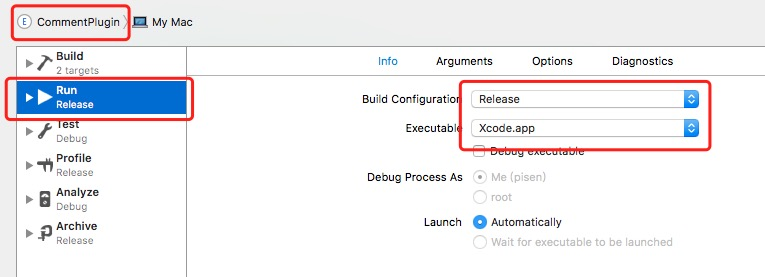
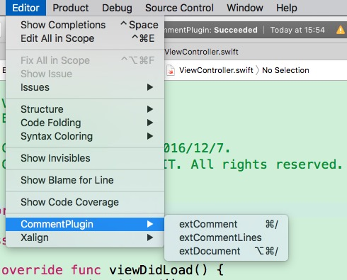
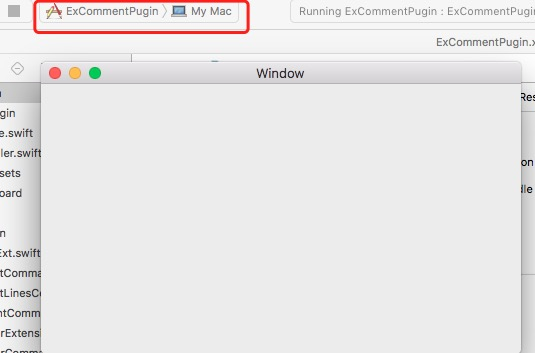
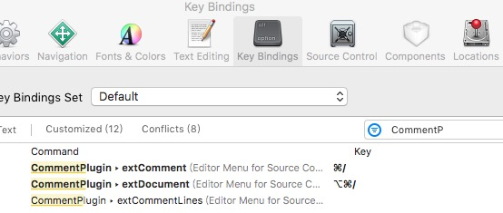
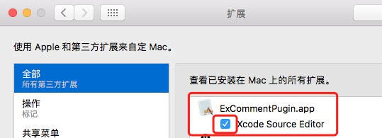
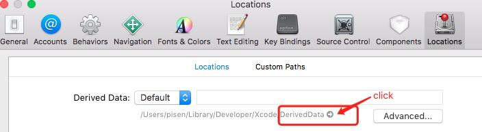
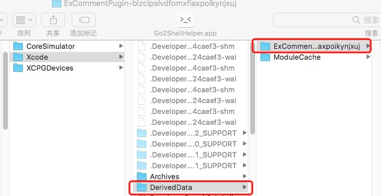
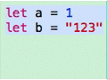
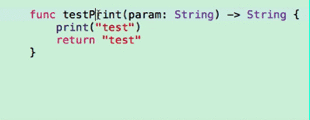

# ExCommentPugin

ExCommentPugin is plugin for Xcode8, which can comment codes and add the documents for functions.

## Requirements

- Xcode 8.0+
- Swift 3.0+

## Installation

1. Edit Scheme `CommentPlugin` 
2. Run `CommentPlugin`, which will create a new gray Xcode, then you can find `CommentPlugin` in `Editor`. 
3. Close the gray Xcode, Run the `ExCommentPugin`, then will create a **mac app**. 
4. Close the normal Xcode, reopen the normal Xcode. Open a project, select a file. If yo find `CommentPlugin` in `Editor`, you can use the plugin now.
5. You can set the **hotkey** for `CommentPlugin`. 

## UnInstallation
1. You can manager the Plugins in `System Perference`, for setting the plugins hidden or not.
2. You can also open the folder **/Xcode/DerivedData**, and delete folder **ExCommentPugin**.

## Usage

1. `extComment` 
2. `extComments` 
3. `extDocument` 